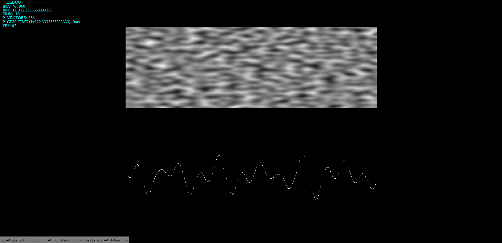

# PerlinNoise

Proof of concept of 1D and 2D perlin noise generatos implemented in Javascript.

## Keyboard shortcuts
| Key | description |
| --- | ----------- |
| z | Decrease Perlin noise frequency |
| x | Increase Perlin noise frequency |
| c | Decrease number of gradient vectors |
| v | Increase number of gradient vectors |
| Space | Show debug information |

Vasco Maia 
October 2022